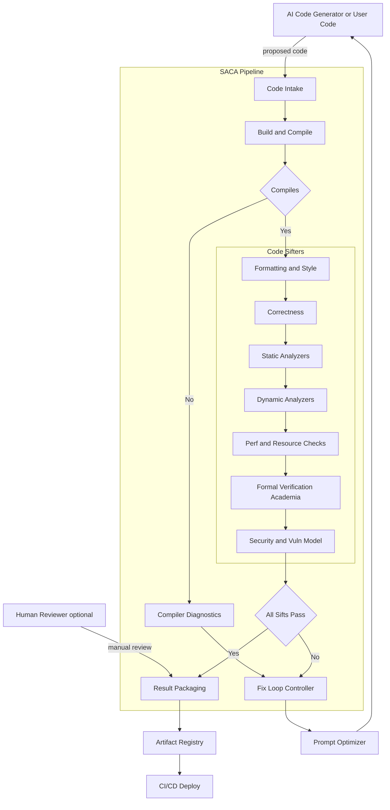

# SACA - Safety AI Code Approval 

~ another name maybe: sacred - safety AI code reassurance to ensure deployment 


---

## Motivation

Safety AI code approval (SACA) aims to ensure a code generated by AI is safe, reliable, and robust, and ready for deployment.
It acts as a safeguard that takes as input the AI-generated code and passes it through different
kinds of sift (bug/vulns/memory/logical) which run both dynamically and statically before the code is getting
reviewed by a human (or hopefully just used straight in production :))

---

## Restrications 

The project will mainly be implemented using classic algorithms, in contructs to using ML blackbox
To be a safety net for the black box, which is an 
AI, we cannot use the blackbox itself. SACA is completely algorithm-based and entirely based on tested, reliable, real, hand-made code and
tools such as clang-tidy, valgrind, code sanitizers, gdb, etc... 

One exception, of course, will be the vulnerability sifter part of SACA.
Since vulnerability searching requires creative and thinking-like abilities, we have to use a generative 
model based on different CVEs and CVEs fixes in addition to the current knowledge of the AI.

---

## Flow and Architecture 

SACA is based on different modules and basically will contain different
testers, both dynamic and static, which allow sifting and editing of the buggy code 
The AI generates.

If it failed the testers, it creates an optimized prompt that gets fed back into the AI 
along with the updated code, and let the AI add/change the fixed code again according to the prompt 
requests.

This process loops until optimized code is achieved, which passes ALL tests: compilation, design, logical, memory and runtime efficiency, tidy, formatting,
vulnerabilities, etc...

Only then will the AI model finally spit out the result to the user.

---

## Flow



---
### Utilities Subprojects of SACA
- AI prompt optimizer - given a prompt, patches and adds additional information to it to achieve the best answer from the AI - 
- a Docker-driven sandbox which will allow the AI (or the dynamic debugging tools to run the sets of tests and search for bugs)


# POC
## What the VS Code Extension Does

The included VS Code extension (`saca`) adds a command:

**`SACA: clang-format + ChatGPT Review (Apply changes)`**

When you run this command on any open source file:

1. **Save & Format**
   - Your file is saved and run through `clang-format` for consistent style.
2. **Review with ChatGPT**
   - The file is passed to `python/review.py`, which:
     - Calls ChatGPT (or mock mode).
     - Produces a **Markdown review** (summary, issues, suggestions).
     - Optionally generates a **revised version** of the file.
3. **Interactive Apply**
   - If revisions are suggested, SACA opens a diff and lets you:
     - **Apply All Changes** (replace the file fully).
     - **Select Hunks…** (pick specific changes to apply).
     - **Skip** (review only).

All steps are logged to the **Output → SACA** panel in VS Code (`Cmd/Ctrl+Shift+U`).

---

## THIS SIMULATES THE NEXT STEP OF THE SACA PROJECT - 
right now, chatgpt is not the one talking to clang-format straight, but the user is sorta "chatgpt" this is for debuggin and developing this project in increments purposes.

## Current Features

- ✅ **Clang-format integration** – formats code before review.  
- ✅ **ChatGPT-powered review** – generates Markdown reports highlighting issues.  
- ✅ **Optional code rewrite** – if the model suggests fixes, you can accept all or parts.  
- ✅ **Interactive diff application** – select hunks to apply.  
- ✅ **Detailed logging** – everything goes to the “SACA” output channel.  
- ✅ **Mock mode** – run without an API key (`export SACA_MOCK=1`).  
- ✅ **Cross-platform** – tested on **macOS** and **Linux** (Windows support via `py` is included).

---

## Setup Instructions

### Prerequisites

- [Visual Studio Code](https://code.visualstudio.com/)
- [Node.js](https://nodejs.org/) (with `npm`)
- [Python 3.9+](https://www.python.org/downloads/)
- `clang-format` in PATH
- An [OpenAI API key](https://platform.openai.com/) (unless running in mock mode)

### Install Dependencies

```bash
cd saca-vscode-ext

# Install VS Code extension deps
npm install

# Build
npm run compile

# Install Python deps
pip install -r python/requirements.txt
Configure Environment

# Required if not in mock mode
export OPENAI_API_KEY="sk-..."

# Optional: run in mock mode (no API calls)
export SACA_MOCK=1
```

## Run the Extension
Open saca folder in VS Code.
Press F5 → this launches an Extension Development Host window.
Open any source file (e.g., .c, .cpp, .py).
Run the command palette → search for:

```
SACA: clang-format + ChatGPT Review (Apply changes)
```
Check View → Output → SACA for logs.

## Example Workflow
Open a messy C file:
```
#include <stdio.h>
int  main ( ) {printf("hello");return 0;}
```
or maybe
```
#include <stdio.h>
int  main ( ) {printf("hello");return 0;


  # HEY chat fix me! 
  // CHATGPT SHOULD ADD HERE print("HELLO ") because i do not not how to 
}
``` 

Run SACA command:

- File is formatted by clang-format.
- ChatGPT reviews the code and suggests improvements.
- A diff view shows the revised version.
- You choose to apply or skip changes.

## Development Notes
- The extension logs everything to the “SACA” output channel.
- review.py can run in:
  - Mock mode (SACA_MOCK=1) – returns a fake revision for testing the flow.
  - Real mode – calls the OpenAI API and parses structured JSON.
- Errors (missing tools, API issues) are surfaced both in VS Code and the logs.

## Disclaimer
This is an experimental prototype.
It should not be relied upon as a sole security measure. Always perform manual reviews for critical code.

## Roadmap / Future Plans
SACA currently focuses on making the code from the AI to compile on your machine

Future versions aim to provide Sifters:

- 🔜 Sandbox execution environment.
- 🔜 Static analysis integration (clang-tidy, clang-format).
- 🔜 Dynamic analysis (valgrind, clang sanitizers).
- 🔜 Vulnerability model – use an AI trained on CVEs to detect unsafe patterns.
- 🔜 Multi-language support – extend beyond C/C++ into Python, Rust, Java.
- 🔜 Full AI Agent that does everything

