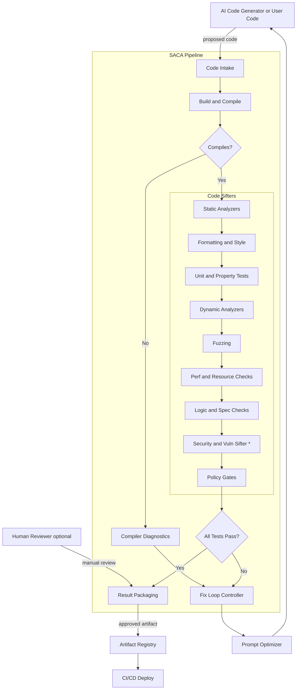

# SOCA - Safety AI Code Approval 

~ another name maybe: sacred - safety AI code reassurance to ensure deployment 

## Motivation

Safety AI code approval (SACA) aims to ensure a code generated by AI is safe, reliable, and robust, and ready for deployment.
It acts as a safeguard that takes as input the AI-generated code and passes it through different
kinds of sift (bug/vulns/memory/logical) which run both dynamically and statically before the code is getting
reviewed by a human (or hopefully just used straight in production :))

The ultimate goal of SACA is to be integrated into every AI code-generating model. This will substantially (and hopefully perfectly) 
remove all bugs that the AI might have created.

## Restrications 

** This project is not using AI to function AT ALL. **
  To be a safety net for the black box, which is an 
  AI, we cannot use AI itself. SACA is completely algorithm-based and entirely based on tested, reliable, real, hand-made code and
  tools such as clang-tidy, valgrind, code sanitizers, gdb, etc... 

  One exception, of course, will be the vulnerability sifter part of SACA.
  Since vulnerability searching requires creative and thinking-like abilities, we have to use a generative 
  model based on different CVEs and CVEs fixes in addition to the current knowledge of the AI.

## Flow and Architecture 

SACA is based on different modules and basically will contain different
testers, both dynamic and static, which allow sifting and editing of the buggy code 
The AI generates.

If it failed the testers, it creates an optimized prompt that gets fed back into the AI 
along with the updated code, and let the AI add/change the fixed code again according to the prompt 
requests.

This process loops until optimized code is achieved, which passes ALL tests: compilation, design, logical, memory and runtime efficiency, tidy, formatting,
vulnerabilities, etc...

Only then will the AI model finally spit out the result to the user.

## Flow

### subprojects which will help SACA work
- AI prompt optimizer - given a prompt, patches and adds additional information to it to achieve the best answer from the AI
- Code Vulnerability Searcher AI model
- a Docker-driven sandbox which will allow the AI (or the dynamic debugging tools to run the sets of tests and search for bugs)
